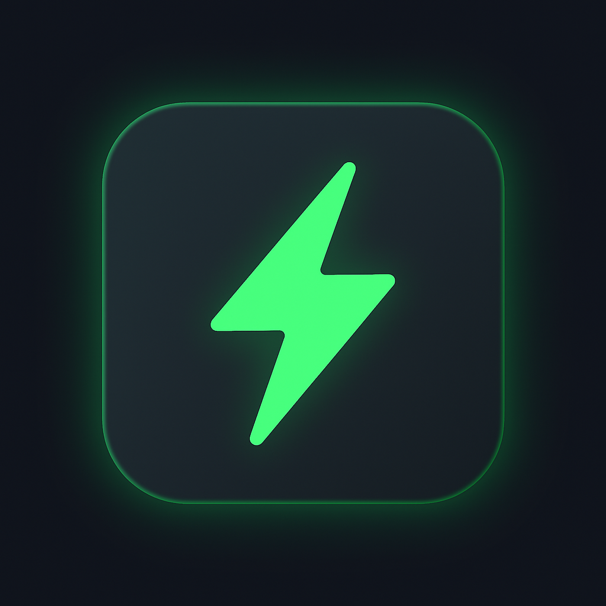

<h1 align="center">Hey, I'm Mashhood 🚀</h1>
<p align="center">
  
</p>

<p align="center">
  <strong>Creative Developer • Full-Stack Innovator • 3D Web Magician</strong><br />
  Building immersive, animated, and AI-powered experiences that make you say "woah." 💥
</p>

---

### 🧠 About Me


- 🔭 Currently learning to create **insane 3D websites** with React Three Fiber + GSAP
- 🧪 Mixing **AI + Web** to build tools from the future
- ✨ Goal: Become the **top 1% creative dev** on the web
- 🎯 Focused on mastering: `Shaders`, `Supabase`, `LangChain`, `Agentic AI`

---

### 🔥 Tech Stack

<p align="center">
  
  
</p>


---

### 🚀 Projects That Hit Different

| Project | What It Does | Tech |
|--------|--------------|------|
| 🛒 **ARC** | Sleek eCommerce site with live tracking | Next.js + Stripe + Sanity |
| 🎙️ **AI Job Agent** | Gemini + Vapi voice interview app | Vapi API + Gemini + Supabase + Supabase Auth |

---

### 📈 GitHub Flex

<p align="center">
  
</p>

<p align="center">

</p>


---

### 🤝 Let’s Collaborate

<p align="center">
  
</p>

- Got a crazy idea? Let’s build it.
- Need a creative dev for your startup? I’m your guy.
- Love cool animations? Let's animate the internet together.

📬 Reach me: [Twitter](https://twitter.com/yourhandle) | [LinkedIn](https://linkedin.com/in/yourhandle)

---

### 🧢 Fun Fact

> "I don’t just write code...  
> I create **experiences** that move with meaning."

---

### 🧠 Currently Learning

```ts
const learning = [
  'LangChain', 
  'Three.js Shaders',
  'Agentic AI',
  'Supabase Magic',
]
